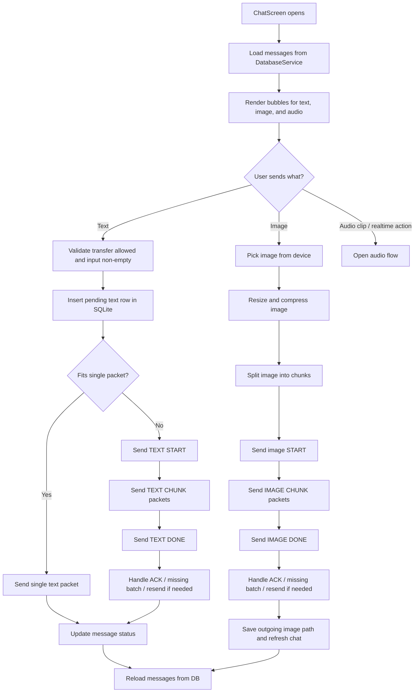
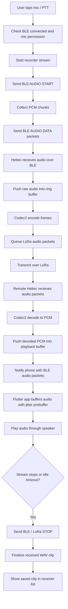
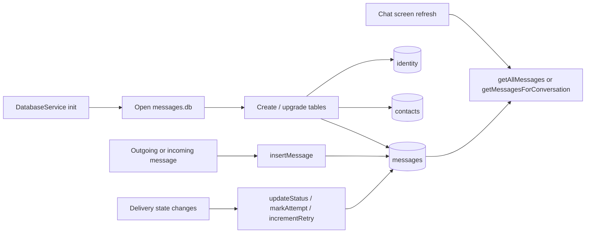

# Realtime LoRa Media App Flowchart

This file summarizes the flow across:

- `lib/main.dart`
- `lib/realtimeaudio_main.dart`
- `lib/database_service.dart`
- `lib/tx.ino`
- `lib/rx.ino`

## Overall System Flow

```mermaid
flowchart TD
    A[App starts] --> B[Initialize Flutter bindings]
    B --> C[Initialize local notifications]
    C --> D[Run MyApp]
    D --> E[Open ScanScreen]
    E --> F[Request Bluetooth, location, camera, mic, notification permissions]
    F --> G{User taps Search Devices?}
    G -->|Yes| H[Check Bluetooth state]
    H --> I{Bluetooth ON?}
    I -->|No| J[Prompt user to enable Bluetooth]
    I -->|Yes| K[Check location service]
    K --> L{Location enabled?}
    L -->|No| M[Prompt user to enable location]
    L -->|Yes| N[Start BLE scan for Heltec devices]
    N --> O[Show scan results]
    O --> P[User selects device]
    P --> Q[Open ChatScreen]

    Q --> R[Connect to BLE device]
    R --> S[Request MTU and discover services]
    S --> T[Find target characteristic]
    T --> U[Enable notifications]
    U --> V[Ready to transmit]

    V --> W{User action}
    W -->|Send text| X[Create message ID and timestamp]
    W -->|Pick image| Y[Compress image and prepare chunks]
    W -->|Realtime audio| Z[Open realtime audio page / start streaming]

    X --> AA[Store outgoing message in SQLite as pending]
    AA --> AB[Build transport packet]
    Y --> AB
    Z --> AC[Build BLE audio packets]

    AB --> AD[Write packet to BLE characteristic]
    AC --> AD
    AD --> AE[Heltec board receives over BLE]

    AE --> AF{Payload type?}
    AF -->|Transport packet| AG[Assemble complete packet if needed]
    AF -->|Realtime audio| AH[Handle START / DATA / STOP audio packets]

    AG --> AI[Fragment transport packet into LoRa frames]
    AI --> AJ[Queue LoRa TX packets]

    AH --> AK[Buffer PCM audio]
    AK --> AL[Codec2 encode]
    AL --> AM[Queue LoRa audio packets]

    AJ --> AN[Transmit over LoRa]
    AM --> AN
    AN --> AO[Remote Heltec receives LoRa]

    AO --> AP{LoRa packet type?}
    AP -->|Transport frame| AQ[Reassemble transport packet]
    AP -->|Audio packet| AR[Decode Codec2 audio]

    AQ --> AS[Notify Flutter app over BLE]
    AR --> AT[Stream decoded PCM over BLE notify]
    AS --> AU[Flutter parses packet]
    AT --> AV[Flutter buffers and plays audio]

    AU --> AW{Content type?}
    AW -->|Text| AX[Update DB and show chat bubble]
    AW -->|Image| AY[Reassemble image, save file, show image bubble]
    AW -->|Audio file or session events| AZ[Update UI state / save media]

    AX --> BA[Show local notification if needed]
    AY --> BA
    AZ --> BA
```

## Chat and Media Flow

## Realtime Audio Flow

## Database Flow

