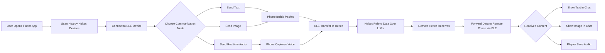
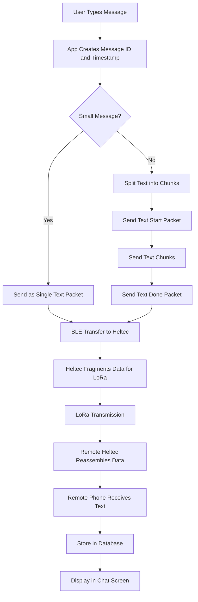
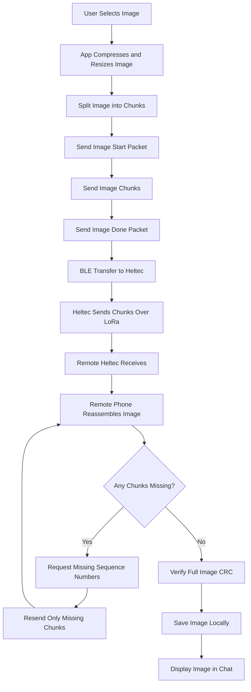
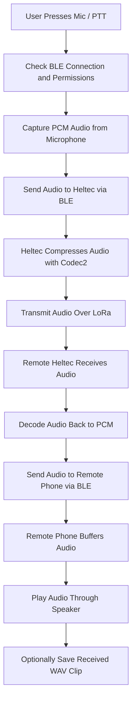
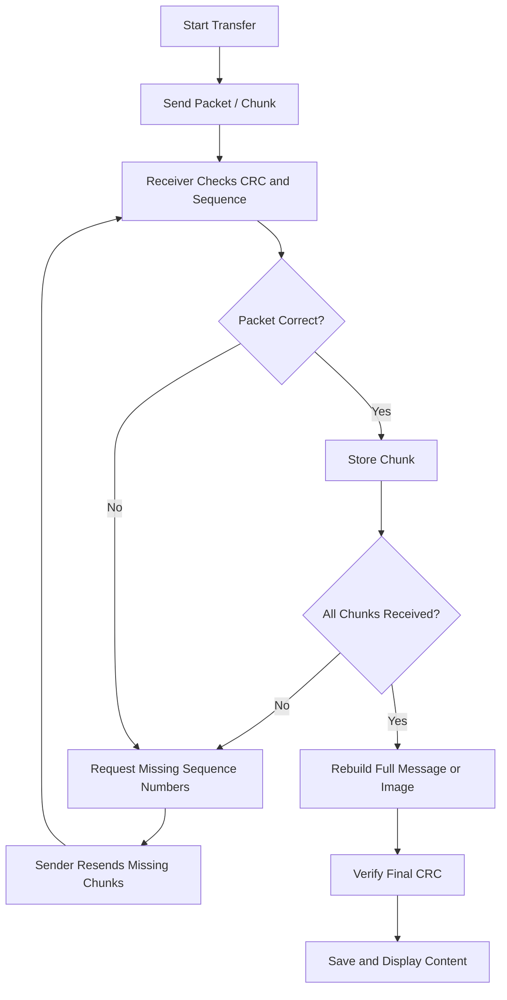

# PowerPoint Flowcharts

These flowcharts are simplified for presentation slides and are easier to explain than the detailed engineering flow.

## 1. Project Overview Flowchart



## 2. Text Message Flowchart



## 3. Image Transfer Flowchart



## 4. Realtime Audio Flowchart



## 5. Reliability Flowchart



## Suggested Slide Order

```text
Slide 1: Project Overview Flowchart
Slide 2: Text Message Flowchart
Slide 3: Image Transfer Flowchart
Slide 4: Realtime Audio Flowchart
Slide 5: Reliability / Missing Sequence Handling
```

## Short Presenter Summary

```text
This project is a Flutter-based communication system that uses BLE to connect a phone to a Heltec LoRa device.
The Heltec board works as a gateway and relays text, images, and realtime audio over LoRa to another device.
At the receiving side, data is reconstructed and shown in the app as chat messages, images, or audio.
To improve reliability, the system uses chunking, CRC verification, acknowledgments, and missing-sequence recovery.
```
